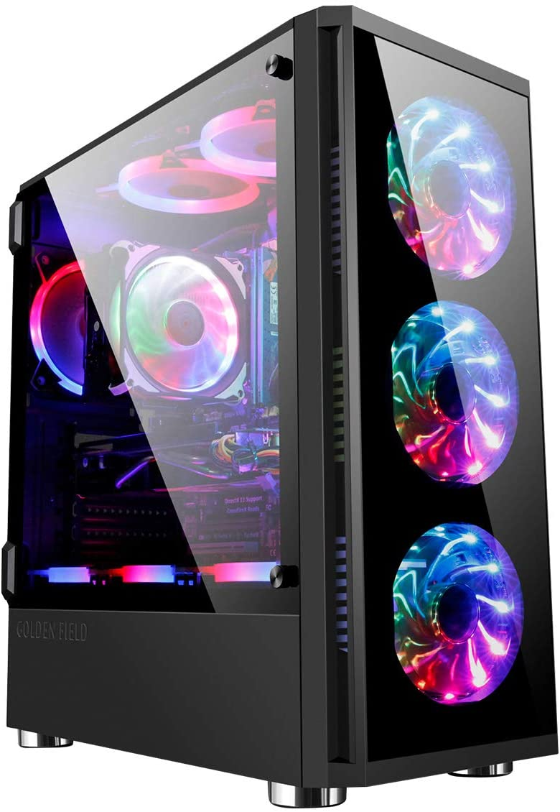
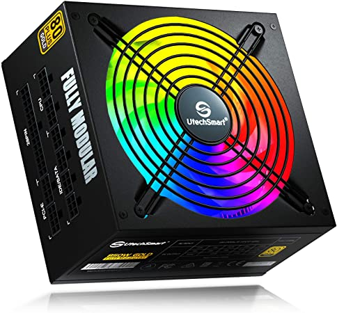

A computer case is essentially just the housing to hold all the parts of the computer. It holds all the parts and protects them from temperatures, contact, and little particles like dust and other things that can clog the computer fans. A good computer case should hold a good fan system to help keep your computer as cool as possible.
A PSU or a power supply unit is in charge of making sure the computer can deliver the required amount of power to the parts of the computer. You must make sure that the supply can produce the amount your computer needs, so make sure you do your research on that before hand.

