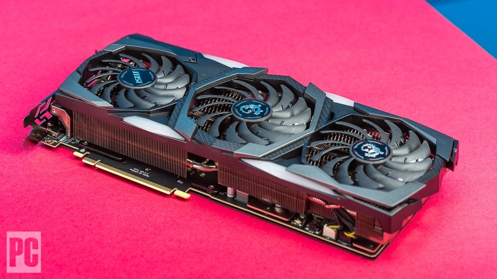

A graphics card is an essential part when building a computer. Without a graphics card, your computer will not be able to display anything without a proper graphics card (unless the motherboard has onboard graphics.).
I personally prefer Nvidia products over the counterpart of AMD products, I have had bad experiences with AMD products and feel they are more cheaply made, but again that is my personal preference.

