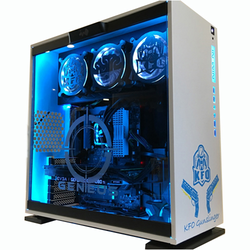

# Final
# Infotc 1600 Final Project
## Konner Burnham
### How to build your own computer
The Digital world is exanpding every minute of every day, and computers are becoming more and more every day essentials.
In this tutorial I will explore the many options of building your own computer in hopes to help anyone with little experience to make this process much easier.
I will list the vital parts of a computer that you should look for below:
1. SSD and Ram
2. Graphics card 
3. Processor and Motherboard
4. Computer Case and Power Supply

[SSDandRam](https://github.com/knke113/Final/blob/main/SSDandRam.md)
[Processor And Motherboard](https://github.com/knke113/Final/blob/main/ProcessorandMotherboard.md)
[Graphics Card](https://github.com/knke113/Final/blob/main/GraphicsCard.md)
[Case and PSU](https://github.com/knke113/Final/blob/main/CaseandPSU.md)
