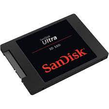
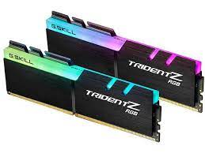

#SSD and Ram
An SSD or Solid State Drive is a newer form of memory allocation for computers. It is more expensive, but way more efficient and quick than the counterpart, a HDD.
Any new age computer build will include an ssd.

RAM or Random Access Memory is important in the computer doing random tasks. The more RAM a computer has, the faster it will be able to process random tasks and handle everyday tasks.

